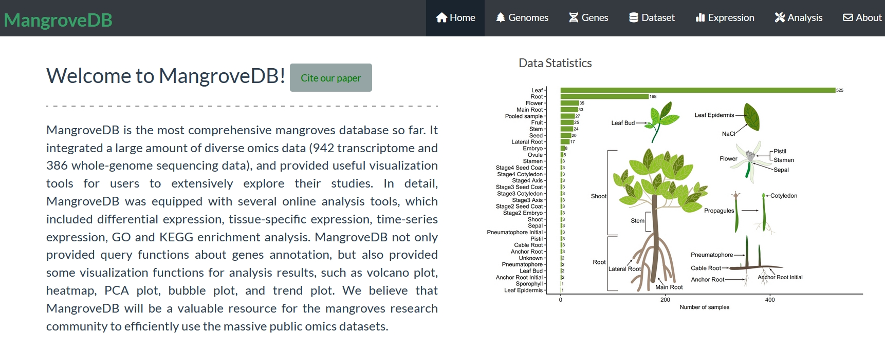

MangroveDB is the most comprehensive mangroves database so far. It integrated a large amount of diverse omics data (942 transcriptome and 386 whole-genome sequencing data), and provided useful visualization tools for users to extensively explore their studies. In detail, MangroveDB was equipped with several online analysis tools, which included differential expression, tissue-specific expression, time-series expression, GO and KEGG enrichment analysis. MangroveDB not only provided query functions about genes annotation, but also provided some visualization functions for analysis results, such as volcano plot, heatmap, PCA plot, bubble plot, and trend plot. We believe that MangroveDB will be a valuable resource for the mangroves research community to efficiently use the massive public omics datasets.

The web sever address is https://jasonxu.shinyapps.io/MangroveDB/

==========================
Home
==========================

The appearance of the home page is shown in the figure below.

Here, seven modules are displayed on the navigation bar. Users can select the specified module Interface.

Users can click the home button to return to the home page.
