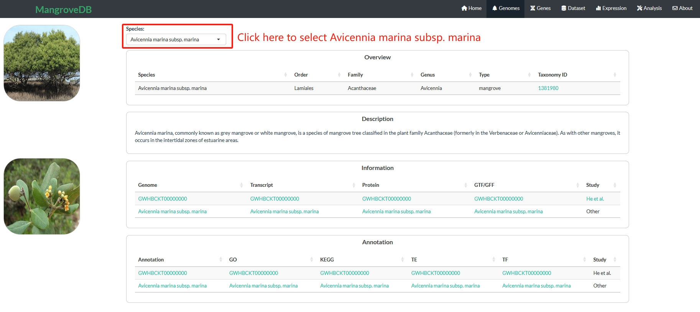

==========================
Genomes
==========================

Users can specify a mangrove species of interset on the drop-down menu, such as Avicennia marina subsp. marina.
Then, return the detailed information of this mangrove species, including overview, description, information, annotation parts.
This genome portal provides genome, transcript, protein sequences, gene features annotation file, and gene functional annotation information, and so forth.

