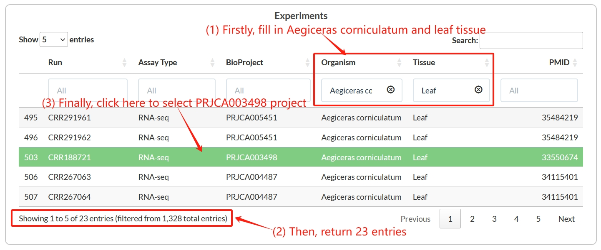
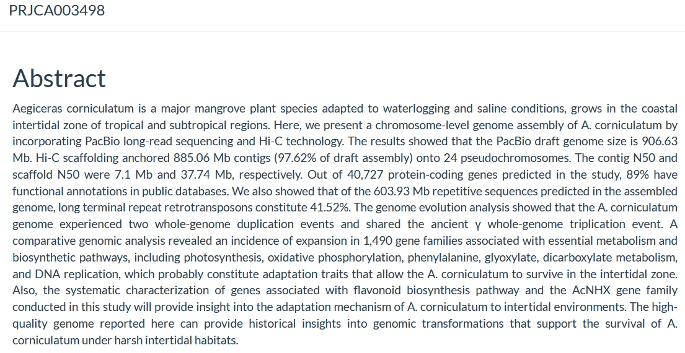
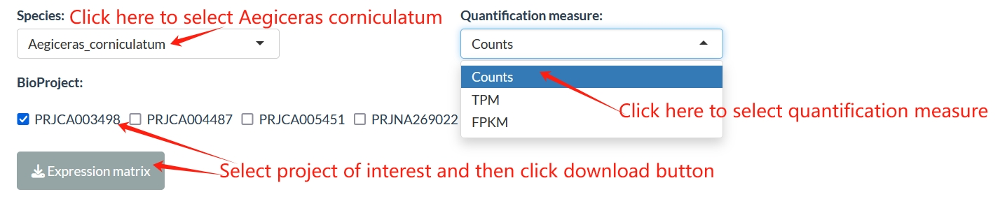

==========================
Dataset
==========================
MangroveDB hosts 40 reference transcriptomes, 13 reference genomes, 873 RNA-seq, 69 microarray, and 386 whole-genome sequencing (WGS) data across 53 mangroves.

		
On the experiments table, users can directly review abstract when users click on one project of interest, such as PRJCA003498.

To conveniently retrieve datasets for users, processed datasets were categorized by mangrove species and BioProject. 
When users select mangrove species Aegiceras corniculatum, database will return corresponding datasets, which were applied to Aegiceras corniculatum.
Then, users can select all projects, or they are only interested with some projects, such as PRJCA003498.
Finally, users can click download button for corresponding expression matrix of the raw count, TPM or FPKM.

